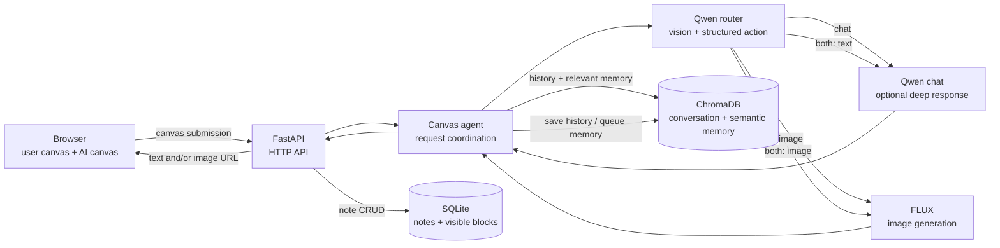

# InkNote AI — Unified Agent Notebook

InkNote provides a shared user canvas and AI canvas. A user can write, sketch,
label a diagram, or combine all three, then submit the page with one **Click**
button.

Qwen3.5 routes each canvas submission to one of four internal actions:

- `chat` — answer or analyze the canvas in text
- `image` — send a refined, text-free visual prompt to FLUX
- `both` — return text and a generated image
- `clarify` — ask a question when the intent is uncertain

## Architecture



The router produces one validated structured result containing the action,
confidence, recognized text, a simple chat response, and an optional FLUX prompt.
Simple chat uses that response directly; complex chat runs a second thinking-enabled
Qwen call. FLUX receives only a cleaned visual prompt, never the notebook pixels.

## Requirements

- Windows
- Python 3.14
- A CUDA-capable GPU for the default local FLUX configuration
- [Ollama](https://ollama.com/) installed and running
- Enough disk space for the Python environment and all three models

Conversation history and semantic-memory vectors are stored locally with embedded
ChromaDB. No separate Chroma server is required.

InkNote does **not** download models automatically. Install the exact models
below before starting the application.

| Provider | Model | Purpose |
| --- | --- | --- |
| Ollama | `qwen3.5:4b` | Non-thinking canvas routing and thinking-enabled deep chat |
| Ollama | `qwen3-embedding:0.6b` | Semantic-memory embeddings |
| Hugging Face | `black-forest-labs/FLUX.2-klein-4B` | Local image generation |

## Installation

### 1. Create the Python environment

Run these commands from the project root:

```powershell
py -3.14 -m venv .venv
.\.venv\Scripts\Activate.ps1
python -m pip install --upgrade pip
pip install -r requirements.txt
Copy-Item .env.example .env
```

If PowerShell blocks activation, run the executables through their full
`.venv\Scripts\` paths instead.

### 2. Install the Ollama models manually

Start the Ollama application, then run:

```powershell
ollama pull qwen3.5:4b
ollama pull qwen3-embedding:0.6b
ollama list
```

Confirm that both exact model names appear in `ollama list`.

If you change `INKNOTE_QWEN_MODEL` or `INKNOTE_EMBEDDING_MODEL` in `.env`,
manually pull the replacement model names as well.

### 3. Download the FLUX model manually

The application loads FLUX from the local Hugging Face cache and uses
`local_files_only=True`; it will not download missing files during startup or
image generation.

First, visit the model repository, accept any license or access terms, and
create a Hugging Face user access token if the repository requires one:

<https://huggingface.co/black-forest-labs/FLUX.2-klein-4B>

Authenticate from the project environment:

```powershell
.\.venv\Scripts\hf.exe auth login
```

Then download the complete repository into the standard Hugging Face cache:

```powershell
.\.venv\Scripts\hf.exe download black-forest-labs/FLUX.2-klein-4B
```

As an alternative to the CLI:

```powershell
.\.venv\Scripts\python.exe -c "from huggingface_hub import snapshot_download; snapshot_download('black-forest-labs/FLUX.2-klein-4B')"
```

To verify the cached model without downloading anything:

```powershell
.\.venv\Scripts\hf.exe cache ls
```

The listing should include `black-forest-labs/FLUX.2-klein-4B`. If you configure
a different `INKNOTE_IMAGE_MODEL` in `.env`, download that repository instead.

`HUGGINGFACE_HUB_TOKEN` may be placed in the local `.env` file when needed.
Never commit a real token or add it to `.env.example`.

### 4. Start InkNote

```powershell
.\run_windows.bat
```

Open <http://127.0.0.1:8000>.

The launcher creates `.env` from `.env.example` when needed, launches Ollama in the
background, and starts Uvicorn. It does not install, check, or download models.

## Troubleshooting model errors

- **Ollama connection error:** open the Ollama application and confirm
  `ollama list` works.
- **Ollama model not found:** pull the exact model name configured in `.env`.
- **FLUX files not found:** rerun `hf download` in the same Windows account that
  runs InkNote.
- **Hugging Face access denied:** accept the repository terms and run
  `hf auth login` again with a token that has read access.
- **CUDA memory error:** keep
  `INKNOTE_IMAGE_RELEASE_AFTER_GENERATION=true` and
  `INKNOTE_IMAGE_CPU_OFFLOAD=true`.
- **Dependency problem:** run
  `.\.venv\Scripts\python.exe -m pip check`.


## Canvas tools

- Pen and eraser
- Stroke-level undo and redo
- Preset and custom colors
- Optional notebook-line layout
- Low, medium, and high image-quality choices
- One automatic Send action

## Project structure

```text
backend/
  agents/       Request routing and chat orchestration
  services/     Ollama, FLUX, and semantic-memory services
  storage/      SQLite notes and persistent ChromaDB history/vector storage
  app.py        FastAPI application and routes
  config.py     Environment and project paths
  schemas.py    Pydantic request models
frontend/
  css/          Stylesheets
  js/           Browser application
  icons/        PWA assets
  index.html
run_windows.bat Windows development launcher
requirements-test.txt
tests/          Non-model unit tests
.github/        GitHub Actions workflow
docs/           Architecture, learning, and API guides
data/           SQLite, ChromaDB, and generated images
```

## Environment

Configuration defaults are documented in `.env.example`. Keep
`INKNOTE_IMAGE_RELEASE_AFTER_GENERATION=true` when Qwen and FLUX share a GPU.
The model names in `.env` must exactly match the Ollama tags and Hugging Face
repository that you installed manually. `INKNOTE_MODEL_CONTEXT_SIZE=32768`
configures a 32K-token context for deep chat.
`INKNOTE_ROUTER_CONTEXT_SIZE=8192` keeps the unified router and memory extraction
bounded. `INKNOTE_QWEN_KEEP_ALIVE=5m` avoids
repeated Qwen reloads between chat requests.

## Local storage

- `data/inknote.db` stores note titles and visible frontend blocks.
- `data/chroma/` is the only active store for Qwen conversation history and
  semantic-memory embeddings.
- Conversation history is stored in the `inknote_conversations` collection.
- Durable memory uses an `inknote_memories_*` collection associated with the
  configured embedding model.
- Semantic vectors are created by the configured Ollama embedding model and supplied
  directly to ChromaDB; Chroma does not download a separate embedding model.
- Deleting a note removes its SQLite row and its ChromaDB conversation record.

The Chroma directory is local runtime data and is excluded by `.gitignore`.

## Design decisions

- **One router call for intent and simple answers:** Qwen returns both the route and
  the simple text response, avoiding a second inference for common chat requests.
- **Deep thinking only when requested by the router:** complex reasoning receives a
  32K thinking-enabled pass while ordinary requests stay on the faster route.
- **Separate UI and model persistence:** SQLite stores note titles and visible blocks;
  ChromaDB stores model conversation context and semantic-memory vectors.
- **Ollama-owned embeddings:** vectors come from `qwen3-embedding:0.6b` and are passed
  directly to ChromaDB. A model-specific collection prevents mixed vector dimensions.
- **Asynchronous memory extraction:** responses do not wait for durable-fact
  extraction. An `asyncio.Queue` batches messages for the background worker.
- **Text-only FLUX boundary:** Qwen converts notebook content into a positive visual
  prompt. Keeping raw notebook pixels out of FLUX reduces copied prompt text.
- **Explicit GPU handoff:** Qwen is unloaded before FLUX claims GPU memory, and FLUX
  can be released after each generation.
- **Selective asynchronous execution:** routing and memory model calls are awaited;
  deep chat, local Chroma operations, and FLUX inference are currently synchronous.

## Failure cases

| Failure | Current behavior | Recovery |
| --- | --- | --- |
| Ollama is unavailable or a model is missing | The model call fails and the browser displays an error. | Start Ollama and pull the exact model configured in `.env`. |
| Qwen returns empty or malformed structured output | The structured helper retries once, then raises an error. | Inspect Ollama logs, model availability, and context limits. |
| Router confidence is below the threshold | The action changes to `clarify`. | Answer the clarification question or provide a more explicit request. |
| An image route has no usable image prompt | The action changes to `clarify`; FLUX is not called. | Restate the desired subject, composition, or style. |
| FLUX is disabled | The API returns a clarification-style availability message. | Set the FLUX provider/model configuration and restart the server. |
| FLUX files are absent from the Hugging Face cache | Local-only pipeline loading fails. | Download the configured repository with `hf download`. |
| CUDA memory is insufficient | Model loading or inference fails. | Enable CPU offload and release-after-generation, or lower concurrent GPU use. |
| ChromaDB cannot be opened or written | Conversation or memory persistence fails. | Check permissions and free space for `data/chroma/`; restore that directory from backup if corrupted. |
| Background memory extraction fails | The completed response remains available, but that batch is not added to durable memory; the error is logged. | Resolve the Ollama/Chroma issue and submit a later message containing the durable fact. |
| The browser request fails | The pending response becomes an error and the submitted canvas snapshot is restored. | Correct the server/network issue and resend. |

## Tests

The unit suite covers:

- structured routing normalization and clarification rules
- Chroma memory relevance filtering without a live database or embedding call
- Pydantic request validation and unsafe conversation IDs
- malformed/empty structured model output and retry exhaustion

It does not start Ollama, load FLUX, download models, or require a GPU.

```powershell
.\.venv\Scripts\python.exe -m pip install -r requirements-test.txt
.\.venv\Scripts\python.exe -m pytest -q
```

GitHub Actions runs the same non-model suite on Python 3.14 for pushes, pull requests,
and manual dispatches using
[`.github/workflows/non-model-tests.yml`](.github/workflows/non-model-tests.yml).
